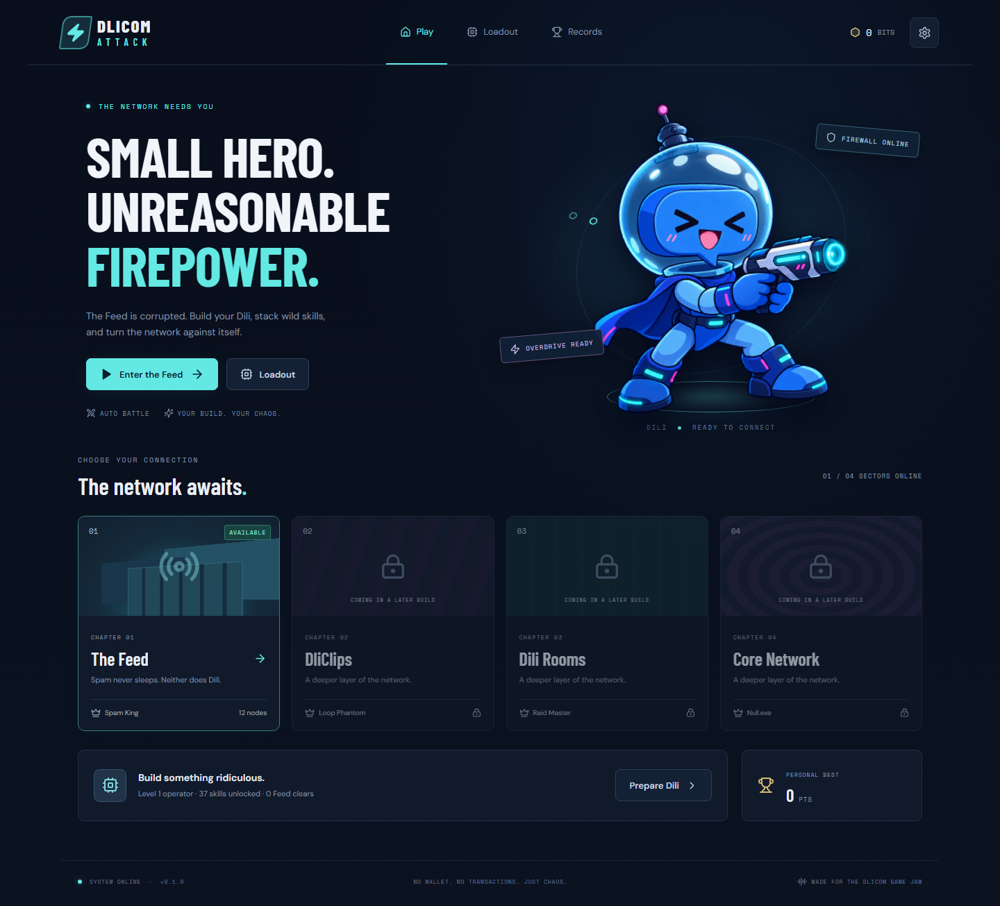

# Dlicom Attack

Build an overpowered Dili, chain Dlicom-themed skills, and fight through a corrupted social network. A browser auto-battle roguelite built with React, TypeScript and Phaser 3.

**Version 0.2.0 — four playable chapters.** Clear each boss to unlock the next corrupted layer of the network.



## Play locally

Use Node.js 22 or newer.

```sh
npm ci
npm run dev
```

Open the URL printed by Vite. Choose an unlocked chapter and watch Dili fight automatically. Between fights, choose one of three skills. Reach that chapter's boss at node 12, collect Bits and equipment, upgrade your loadout, and try another build.

- Mouse/touch only; no aiming or manual movement.
- Pause and ×1/×2 during battle.
- Tap a skill/status to inspect it.
- Music, SFX, reduced motion and default speed in Settings.
- Equipment, Bits, account unlocks, records and settings save locally. An active run is in memory; refreshing ends it. A malformed save is backed up where storage permits and defaults recover safely.

## Included in v0.2

- Four complete chapter routes: The Feed / Spam King, DliClips / Loop Phantom, Dili Rooms / Raid Master, and Core Network / Null.exe. Win to unlock the next chapter.
- Each run has 12 nodes, normal battles, elites, events, rest, its chapter boss, victory/defeat, rewards and retry.
- Seeded combat, encounters, skill drafts and chest drops. Seed appears in the result text for reproduction.
- Crit, capped combo, counter, dodge, shields, statuses, lifesteal, Rage/Ultimate, lethal prevention and once-per-run revive.
- All 70 starter skill definitions; prerequisites, four skill rarities, affinity weighting, Rare+ pity, Packet Boost ranks and one free reroll.
- Six build families unlock across account levels 1–6, following the supplied progression order.
- Three equipment slots, 18 equipment items across four rarities, five upgrade levels and a chest on victory.
- Twenty seeded events with choices, run buffs, healing, Bits, skill drafts and optional elite fights.
- Dili reference-based combat poses, distinct generated sprites for all ten normal enemy kinds and four bosses, four illustrated chapter battle backgrounds, one original synthesized music loop per chapter, bounded VFX/text objects and SFX.
- Responsive desktop/mobile UI, keyboard focus states, local fonts and local audio.

## Architecture

| Layer | Ownership |
| --- | --- |
| `src/game/combat`, `src/game/run`, `src/game/rng` | Pure TypeScript combat, triggers, seeded RNG, drafts, rewards and run transitions |
| `src/game/phaser` | Presentation events, sprite motion, projectiles, VFX and bounded animation queue |
| `src/app`, `src/stores` | React screens and Zustand orchestration; no duplicate combat formulas |
| `src/content` | Skills, gear, encounters, centralized assets and Zod validation |
| `src/services` | Versioned save boundary and Howler audio |

Combat resolves before animation. Presentation callbacks never determine HP, rewards, death or progression. Trigger guards cap combo, depth and event counts; a 150-turn stalemate ends as a recoverable defeat.

## Verification

```sh
npm run typecheck
npm run lint
npm run validate:content
npm test
npm run build
npx playwright install chromium firefox webkit
npm run test:e2e
npm run simulate
```

CI runs types, lint, content validation, unit/integration tests, a production build, and all seven browser flows on Chromium, Firefox and WebKit. The browser tests cover isolated fresh profiles, local save reload, all four chapter battle assets, mobile/desktop viewport layouts, settings, result sharing (with clipboard isolated in the test context), combat timing and a complete first-chapter run. They fail on uncaught app exceptions and unexpected console errors; Firefox's `InvalidStateError: Navigated away from page` during explicit test reloads is an expected browser cancellation and is ignored. The recorded deterministic balance sample covers 10,000 full runs, 2,500 per chapter, with a simple damage-priority draft bot; it is not a human playtest. Set `SIM_RUNS`, `SIM_CHAPTER`, and `SIM_UNLOCKED=1` to sample a particular chapter with unlocked equipment. The output includes median and 90th-percentile combat time, plus the share spent between presented events; menu and decision time is excluded.

See [verification and balance report](docs/IMPLEMENTATION_STATUS.md) for measured results and limitations.

## Deploy

Import `mrchaosdev/Dlicom-go` into Vercel. Root directory: repository root. Build command: `npm run build`. Output directory: `dist`. `vercel.json` is included. No backend, secrets or environment variables are needed. GitHub push alone does not create a Vercel deployment.

## Remaining production work

- Character pose polish and expanded SFX. The [art and animation matrix](docs/ART_ANIMATION_MATRIX.md) tracks state coverage and remaining physical-device QA.
- Human balance/pacing pass: a deterministic 500-run stress bot with max-level gear won 38.8% of DliClips, 27.0% of Dili Rooms, and 36.0% of Core Network runs; it does not model human build choices. Core tuning now gets nearly every run to Null.exe, where the boss remains the main win gate. The overall 8–15 minute target has **not** been met or verified; human playtesting and a deliberate pacing pass remain necessary.
- Human pacing, balance and readability playtests; physical Android/iOS device testing; Edge and long-session performance checks; deployed smoke test, trailer and final submission. The 10,000-run simulation's combat-only medians are 145–181 seconds; the 8–15 minute full-session target is not verified.
- Share result copies the score, build and seed as text. A graphical share-card export is not implemented.

## Specification and provenance

Read [AGENTS.md](AGENTS.md), [BOT_READ_FIRST.md](BOT_READ_FIRST.md), then the [documentation index](dlicom-attack-docs/docs/00_README.md). The supplied [master spec](DLICOM_ATTACK_MASTER_SPEC.md) and original documentation are preserved. Reversible defaults and ambiguity resolutions are recorded in [implementation assumptions](docs/ASSUMPTIONS.md).

Artwork/audio sources and the exact image prompt are in [asset credits](docs/ASSET_CREDITS.md). No third-party game art, characters, UI layout, proprietary content or audio were copied. Supplied Dlicom reference art retains its original ownership.

No pets. No wallet connection. No seed phrases. No payments or crypto transactions. No account registration, backend or private-data capture. No analytics or external font requests.
